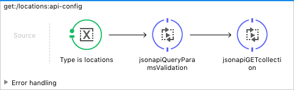

# demo-jsonapi

A demonstration MuleSoft RESTful API that is based on the [{json:api}](http://jsonapi.org) standard.

## Contents

- [Introduction](#introduction)
- [{json:api} 1.0 and json-schema.org in RAML 1.0 snippets](#jsonapi-10-and-json-schemaorg-in-raml-10-snippets)
- [The Example API's RAML](#the-example-apis-raml)
- [RAML Libraries](#raml-libraries)
- [The Mule App](#the-mule-app)
- [{json:api} Mule Snippets](#jsonapi-mule-snippets)
   - [jsonapi-exceptions.xml](#jsonapi-exceptionsxml)
   - [jsonapi-flows.xml](#jsonapi-flowsxml)
- [Developer Notes](#developer-notes)
- [TO DO](#to-do)
   
## Introduction

This is a demo of a (almost)fully-baked API that follows Columbia's (developing)
[integration standards](https://wiki.cc.columbia.edu/ea:enterprise_integration).

REST APIs represent data and operations on that data. Let’s outline
what’s needed and the standards we’ve chosen to adopt (in an iterative
fashion):

1. **Model the business process.** This is accomplished by following the
   [TOGAF](http://pubs.opengroup.org/architecture/togaf9-doc/arch/) Architecture Development
   Methodology’s [Business Architecture](http://pubs.opengroup.org/architecture/togaf9-doc/arch/chap08.html)
   Phase (Chapter 8). You need to know what you are trying to
   accomplish with this API before you build it!

2. **Model the data.** This is accomplished by following the TOGAF
   Architecture Development Methodology’s
   [Data Architecture](http://pubs.opengroup.org/architecture/togaf9-doc/arch/chap10.html)
   Phase (Chapter 10). See, for example, CU’s
   [People Data Model](https://wiki.cc.columbia.edu/ea:people_data_model).

3. **Create schemas.** Once a high-level data model is defined, create
   schema definition(s) using
   [our standard](https://wiki.cc.columbia.edu/ea:enterprise_integration:schema_standards)
   which is [json-schema.org](http://json-schema.org/) (RFC
   [draft-wright-json-schema-0](https://tools.ietf.org/html/draft-wright-json-schema-01)1).

4. **Model the application service.** See
   [Application Architecture](http://pubs.opengroup.org/architecture/togaf9-doc/arch/chap11.html)
   Phase (chapter 11). This is a REST API which is generally one small
   microservice in the larger scheme of things.

5. **Create REST resource & method definitions.** We use an
   [API contract language](https://wiki.cc.columbia.edu/ea:enterprise_integration:api_specifications)
   ([RAML](http://raml.org)) to iteratively define the API jointly
   between the API provider and consumer developers. The contract
   language is used in conjunction with a content specification using
   [{json:api}](http://jsonapi.org) which references the schemas
   defined above in a standard self-describing way with various
   metadata.

6. **Implement the API.** Using the RAML definition, scaffold an app
   using MuleSoft's AnyPoint API Platform and Studio to begin
   implementing the various methods on the defined
   resources. **Deliver minimum viable product and iterate.**

As this is a trivial demo, we're going to gloss over steps 1 and 2 and jump right in to {json:api}
modeling in RAML.

## {json:api} 1.0 and json-schema.org in RAML 1.0 snippets

{json:api} standardizes the request-response flow of a RESTful applications.
[RAML 1.0](https://github.com/raml-org/raml-spec/blob/master/versions/raml-10/raml-10.md) is the modeling
language currently supported by MuleSoft although it looks like it may be replaced by
[OAS 3.0](https://github.com/OAI/OpenAPI-Specification/blob/master/versions/3.0.0.md) soon.

To make it easier for a developer to adopt these tools, I've created some
[RAML snippets](https://github.com/n2ygk/raml-snippets) based on the {json:api} specification. You
simply `use` these libraries in your RAML definition.

### Schemas: RAML 1.0 Types
RAML 1.0 is json-schema.org "aligned" and allows `types` (the RAML 1.0 replacement for
`schemas` -- which are now deprecated) to be coded either in RAML or as a json-schema JSON document.
However, when using type inheritance (required for the {json:api} types), one must use RAML 1.0 rather than
JSON. If you later want to covert your RAML type definition to json-schema, it's pretty easy.

### {json:api} request/reply and schema metadata

{json:api} defines standard JSON success and failure responses to all the usual HTTP methods and for request bodies for
POST and PATCH as well as a sophisticated HATEOAS model. I don't pretend to understand how to use it fully yet.
Just take a look at the specification at http://jsonapi.org/format.

## The Example API's RAML

Here's a quick walk through the API's RAML, starting at the root:

### api.raml

[api.raml](src/main/api/api.raml) is the root API document, and one of the few you'll need to edit for your own
app; the others are the app-specific schema definitions.

This API currently has three root-level resources defined: `/locations`, `/widgets`, and, as a debugging
tool (to be described later), `/objects`.

```YAML
#%RAML 1.0
title: demo-jsonapi
description: a sample RESTful API that conforms to jsonapi.org 1.0
version: v1
baseUri: https://test-columbia-demo-jsonapi.cloudhub.io/{version}/api
documentation: 
  - title: About {json:api} 1.0
    content: 
      This is an example of a [jsonapi 1.0](http://jsonapi.org/format) RESTful API
      which uses mediatype (application/vnd.api+json) in requests and responses.
  - title: The jsonApiLibrary (api.*) types
    content: 
      The types defined in library `jsonApiLibrary.raml` are derived directly from the jsonsapi 1.0 
      [specification](https://github.com/json-api/json-api/blob/gh-pages/schema)
      (which is defined using the [json-schema.org](http://json-schema.org/documentation.html) specification).
      They were translated from JSON to YAML and then manually edited in several cases where a json:api
      capability is not directly available in RAML (for instance, _patternProperties_). 
      
      When referencing those types
      in your API, you must prefix them with the library name you've given in the `uses` statement. In this example, that 
      is `api`. For reasons I don't quite understand, you must use this with the same uses key name
      (api) in this main api.raml and any other libraries that reference types defined in jsonApiLibrary.raml such
      as the WidgetType and LocationType definitions.
  - title: The Locations and Widgets types
    content: 
      The Locations and Widget types are the types managed by this sample API. They are all subclasses of the
      api.resource type and also subclass api.attributes from the jsonApiLibrary.raml library. 
uses: 
  api: libraries/jsonApiLibrary.raml
  loc: libraries/LocationType.raml
  wid: libraries/WidgetType.raml
  col: libraries/jsonApiCollections.raml
  cu: libraries/columbiaLibrary.raml
  obj: libraries/ObjectType.raml

# the API's resources:
/widgets:
  displayName: widgets
  description: stuff we have in inventory
  type: 
    col.collection: 
      dataType: wid.Widget
      exampleCollection: !include examples/WidgetCollectionExample.raml
      exampleItem: !include examples/WidgetItemExample.raml
  get:
    is: [ cu.oauth_read_any, col.all-the-things ]
  post:
    is: [ cu.oauth_create_any ]
  /{id}:
    type: 
     col.item:
        dataType: wid.Widget
        exampleItem: !include examples/WidgetItemExample.raml
    get:
      is: [ cu.oauth_read_any, col.sparse ]
    patch:
      is: [ cu.oauth_update_any ]
    delete:
      is: [ cu.oauth_delete_any ]
    /relationships:
      description: widget relationships
      # no methods here...
      /locations:
        description: (many) locations of widgets in inventory
        type:
          col.relationshipCollection:
            dataType: wid.widgets_relationships_locations
            exampleCollection: !include examples/WidgetRelationshipsLocationsCollectionExample.raml
            exampleItem: !include examples/WidgetRelationshipsLocationsItemExample.raml
        get:
          is: [ cu.oauth_read_any, col.all-the-things ]
        post:
          is: [ cu.oauth_create_any ]
        patch:
          is: [ cu.oauth_update_any ]
        delete:
          is: [ cu.oauth_delete_any ]
      /manufacturer:
        description: (one) manufacturer of the widget
        type:
          col.relationshipItem:
            dataType: wid.widgets_relationships_manufacturer
            exampleItem: !include examples/WidgetRelationshipsManufacturerItemExample.raml
        get:
          is: [ cu.oauth_read_any, col.all-the-things ]
        patch:
          is: [ cu.oauth_update_any ]
/locations:
  displayName: locations
  description: inventory locations
  type: 
    col.collection: 
      dataType: loc.Location
      exampleCollection: !include examples/LocationCollectionExample.raml
      exampleItem: !include examples/LocationItemExample.raml
  get:
    is: [ cu.oauth_read_any, col.all-the-things ]
  post:
    is: [ cu.oauth_create_any ]
  /{id}:
    type: 
     col.item:
        dataType: loc.Location
        exampleItem: !include examples/LocationItemExample.raml
    get:
      is: [ cu.oauth_read_any, col.sparse ]
    patch:
      is: [ cu.oauth_update_any ]
    delete:
      is: [ cu.oauth_delete_any ]
/objects:
  displayName: objects
  description: The object store persists all the types used above. Use this utility resource
    to GET or DELETE the entire contents of the object store.
  type: 
    col.collection:
      dataType: obj.Object
      exampleCollection: !include examples/ObjectCollectionExample.raml
      exampleItem: !include examples/ObjectItemExample.raml
  get:
    is: [ cu.oauth_read_any ]
  delete:
    description: DELETES the entire object store
    is: [ cu.oauth_delete_any ]
    responses: 
      204:
        description: Sucessfully deleted. No content returned.
```


## RAML Libraries

This API pulls in several libraries. Note that RAML uses the key before the name of the library file
as the namespace; you have to refer to definitions in the library using _namespace_._definition_.

###  api: libraries/jsonApiLibrary.raml

[jsonApiLibrary.raml](src/main/api/libraries/jsonApiLibrary.raml) contains the type definitions
from the spec. You don't actually need to know what these are as the collections library references them:

###  col: libraries/jsonApiCollections.raml

#### ResourceTypes: collection, item, relationshipCollection, relationshipItem.

[jsonApiCollections.raml](src/main/api/libraries/jsonApiCollections.raml) defines several resourceTypes.

The `collection` and `item` resourceTypes follow the [{json:api} 1.0 recommendations](http://jsonapi.org/recommendations/#urls) 
regarding URL naming: a resourcePathName should be the same as it's type (both plural nouns). However, because
we may be using RAML Libraries for those type definitions, one can't use *resourcePathName* but must still
provide a *dataType*.

The `relationshipCollection` is a special resourceType for _to-many_ `relationships` that allows GET, POST, PATCH & DELETE.
(Normal `collection`s don't allow PATCH or DELETE of the entire collection.) The `relationshipItem` is a special
resourceType for _to-one_ `relationships` that allows GET & PATCH.

**collection required parameters**:
- dataType: the response RAML type (e.g. `mythings`). You must also define types named e.g. `mythings_post` and
  `mythings_patch`. These are all subclasses of on another with various properties labeled as true. This deals
  with the requirement that response data must have `id` and `type` keys which post data can leave out the `id`
  but must have all the required primary data attributes and patch data can leave out required attributes as it
  only sends changes.
- exampleCollection: an example collection of the dataType.
- exampleItem: an example item of the dataType.

#### Traits: pageable, sortable, sparse, filterable, includable, all-the-things

Traits of `pageable`, `sortable`, `sparse`, `filterable`, `includable` are provided which describe the various
[standard](http://jsonapi.org/format) query parameters, including [recommended](http://jsonapi.org/recommendations) usage.
For convenience, the `all-the-things` trait combines all the above-listed traits.

Usage example:
  ```
  uses:
	col: libraries/jsonApiCollections.raml
  /widgets:
	type: 
	  col.collection: 
		dataType: wid.widgets
		exampleCollection: !include examples/WidgetCollectionExample.raml
		exampleItem: !include examples/WidgetItemExample.raml
	get:
	  is: [ col.pageable, col.sparse ]
  ```
  
### cu: libraries/columbiaLibrary.raml

[columbiaLibrary.raml](src/main/api/libraries/columbiaLibrary.raml) defines Columbia-specific securitySchemes
pnd traits:

#### SecuritySchemes: oauth_2_0 and oauth_2_0_test

**oauth_2_0** is our production OAuth 2.0 service and the one that is integrated with AnyPoint API Manager:
client credentials registered in API Manager are stored in the production OAuth server.

**oauth_2_0_test**, Columbia's test OAuth 2.0 service, is not synced with API Manager; If you need to test with it
and MuleSoft, you'll need to get the credentials sync'd up. Also, the traits are only defined for the oauth_2_0:

#### Traits: CRUD w/OAuth

Use `is: [ cu.oauth_read_columbia ]`, for example, to require a Shibboleth login and `read` scope.
The current list of these is:

 - **oauth_read_columbia**: Authorization Code w/scopes: auth-columbia, read.
 - **oauth_read_any**: Authorization Code w/scopes `read` and one of
   auth-{columbia,facebook,google,linkedin,twitter,windowslive}
   or Client Credentials scope auth-none.
 - **oauth_create_{columbia,any}**: as above with create scope
   **oauth_update_{columbia,any}**: as above with update scope
   **oauth_delete_{columbia,any}**: as above with delete scope

You'll probably want to define some traits specifically for your app. If they are generic enough,
make sure they get added to this library.

###  wid: libraries/WidgetType.raml

This demo app has widgets manufactured by a company and in inventory at locations. 
Here's the `widgets` type definition. The key things to note when you define our own types are:

Your type _extends_ (is a subclass of) the `api.resource_post` type from {json:api}. This type has
a specific shape that you have to comply with:

- It always has a top-level `type` string which says what type it is.
- It always has a unique `id` string which is the instance identifier. Do not be tempted to hang any
  semantics off the id; Use an `attribute` for that.
- It has a top-level `data` element which can be a single or array of objects (or empty).
  Under the data element are:
  - The `attributes` element which is a map containing your "useful" attributes. Put your information here.
  - Some additional optional elements like `relationships` which describe the relationship of this
    entity to others.

Once you inherit from `api.resource_post` this whole framework is just there. Just need to override/add elements
that are specific to your schema.

Here's the widgets type example, which includes relationships to the locations type. The name of the relationship
is `locations`. There's also a `manufacturer` relationship (incomplete as companies type it references is not yet defined).

You'll note the wierd use of widgets\_post and widgets\_patch. This is to compensate for RAML's enforcement of mandatory properties.
For example a GET returns a `widgets` which has required `type` and `id` properties. However, if one is POSTing a new `widgets`,
you want to leave out the `id` since the server will likely assign it. Similarly, even though some widgets
`attributes` are mandatory, they all have to be optional for PATCHing.

Defining \_post and \_patch names is **mandatory** if you are using the `collection` and `item` resourceTypes; the `<<dataType>>`
is referenced as `<<dataType>>_post` for POST, `<<dataType>>_patch` for PATCH and just `<<dataType>>` for GET.

```YAML
#%RAML 1.0 Library
usage: Schema for a Widget
uses:
  api: jsonApiLibrary.raml
types:
  widgets:
    description: a widget response
    type: widgets_post
    properties:
      id:
        required: true
    example:
      type: widgets
      id: abc-123
      attributes:
        name: can opener
        qty: 42
      relationships:
        locations:
          data: 
            - type: locations
              id: "14"     
            - type: locations
              id: "15"
          links:
            self: /widgets/abc-123/relationships/location
  widgets_post:
    description: a POSTable widget's primary (id is optional, required attributes are indicated)
    type: widgets_patch
    # looks like inheritance is not multi-level. This is WET!
    properties:
      attributes:
        required: false
        properties:
          name:
            required: true
            type: string
            description: catalog name
          qty:
            required: false
            type: integer
            minimum: 0
            description: quantity
    example:
      type: widgets
      attributes:
        name: can opener
        qty: 42
      relationships:
        locations:
          data: 
            - type: locations
              id: "14"     
            - type: locations
              id: "15"
          links:
            self: /widgets/abc-123/relationships/locations
  widgets_patch:
    description: a PATCHable widget's primary data. Only supply attributes or relationships that are changed.
    type: api.resource_post
    properties:
      attributes:
        required: false
        properties:
          name:
            required: false
            type: string
            description: catalog name
          qty:
            required: false
            type: integer
            minimum: 0
            description: quantity
      relationships:
        type: widgets_relationships
        required: false
    additionalProperties: false
    example:
      type: widgets
      id: abc-123
      attributes:
        qty: 42
      relationships:
        locations:
          data: 
            - type: locations
              id: "13"
  widgets_relationships:
    type: api.relationships
    description: |
      A widget's relationships: 
        - locations: is the list of locations a widget is stored in inventory
        - manufacturer: the manufacturer of the widget
    properties:
      locations:
        type: api.relationshipMember
        description: locations in inventory for the widget
        required: false
      manufacturer:
        type: api.relationshipMember
        description: manufacturer
        required: false
    example:
      locations:
        data: 
          - type: locations
            id: "14"     
          - type: locations
            id: "15"
        links:
          self: /widgets/abc-123/relationships/locations
      manufacturer: 
        data: 
          type: companies
          id: "abc123"
        links: 
          self: /widgets/abc-123/relationships/manufacturer
  # relationships have only type, id and links; no other attributes.
  widgets_relationships_locations:
    type: widgets_relationships_locations_post
    properties:
      id:
        required: true
  widgets_relationships_locations_post:
    type: widgets_relationships_locations_patch
  widgets_relationships_locations_patch:
    type: api.resource_post
    description: locations in inventory
    example:
      type: locations
      id: "14"
      links:
        self: /widgets/abc-123/relationships/locations
  widgets_relationships_manufacturer:
    type: widgets_relationships_manufacturer_post
    properties:
      id:
        required: true
  widgets_relationships_manufacturer_post:
    type: widgets_relationships_manufacturer_patch
  widgets_relationships_manufacturer_patch:
    type: api.resource_post
    description: manufacturer
    example:
      type: companies
      id: "abc123"
      links:
        self: /widgets/abc-123/relationships/manufacturer
```

Location and Object are similar. See the source.

## The Mule App

Once you've got fully-baked RAML pulled from the libraries, with all the options filled in, the power of
API Designer or Anypoint Studio becomes apparent: they won't let you create incorrect RAML (especially useful
when defining your types and examples) and APIkit will mock example responses that work.

See the Anypoint Studio-generated documentation in doc/index.html (open it with your browser).

The mocked app that API Designer presents
and the Mule APIkit scaffold that is generated are quite complete; APIkit enforces most stuff like checking
for valid mediatypes (Application/vnd.api+json) although it does not enforce RAML securedBy policies (use
the [OAuth2 Scope Enforcement](https://github.com/n2ygk/mulesoft-oauth2-scope-enforcer) custom policy for that
nor does it prevent extra query parameters beyond those that are defined. Also, the default APIkit exception
mappings (e.g. what to return with a 404 status) do not comply with {json:api}. For that there are:

## {json:api} Mule Snippets

The following Mule snippets enhance your API to be {json:api} compatbile.

### jsonapi-exceptions.xml

This module defines a global APIkit exception mapping that replaces the default one. Errors are
returned according to `api.failure` in the jsonApiLibrary. For example:

```JSON
{
    "errors": [
        {
            "id": "b5eebd89-c641-4b1d-9aec-21d680556a58",
            "status": "404",
            "title": "Resource not found",
            "detail": "Value is not found for { key=Widget:123 }"
        }
    ]
}
```

To use these replacement exceptions, change the `api-main` flow's Reference Exception Strategy to
`jsonapi-exception-mapping`.


#### 409 Patch Conflict

It also adds the 409 Conflict response to PATCH. You can throw this from your app code, for example,
in Groovy:
```
throw new PatchConflictException('foobar')
```

This requires that you include the [src/main/java/PatchConflictException.java](src/main/java/PatchConflictException.java).

#### Sidebar: Python can raise Java exceptions but they are wrapped in PyException

Unfortunately, Jython wraps all exceptions in the PyException class: You have to catch `org.python.core.PyException`
and then figure out how to unwrap it and route it to the correct handler. If you can figure out how to get this
to work, please let me know!

```python
import org.mule.module.apikit.exception.BadRequestException
props = message.getInboundProperty('http.query.params')
if 'fail' in props:
  raise org.mule.module.apikit.exception.BadRequestException("foo")
```

### jsonapi-flows.xml

This module defines some common flows and implements them with Mule's Object Store. It is about a 75% complete
implementation of jsonapi. Most methods are implemented with a few open items. (See [TO DO](#to-do) below.)
You could potentially start with this code and replace the objectstore with your SQL database
and add some side effects to various methods (where the application logic happens). Oh, and rewrite it tighter and neater
and submit a PR.

The flows are:

- **jsonapiGETitem** gets an item of type `flowVars.type`. For now, you must define `type` in the calling flow.
   or, as XML:
  ```xml
  <flow name="get:/locations:api-config">
    <set-variable variableName="type" value="locations" doc:name="Type is locations">   </set-variable>
    <flow-ref name="jsonapiQueryParamsValidation" doc:name="jsonapiQueryParamsValidation">  </flow-ref>
    <flow-ref name="jsonapiGETcollection" doc:name="jsonapiGETcollection">  </flow-ref>
  </flow>
  ```
- **jsonapiGETcollection** gets a collection. As above `type` must be defined.
- **jsonapiGETrelationships** gets the relationships for the given item.
- **jsonapiPOSTitem** posts an item. The type is obtain from the item's `type` element.
- **jsonapiDELETEitem** deletes an item.
- **jsonapiPATCHitem** updates an item.
- **jsonQueryParamsValidation** does a simplistic job of making sure the query parameters are from the {json:api}
  vocabulary; They do no validation beyond that.

## Developer Notes

Here are a few notes for developers:

### Client Apps

- If you are writing a client app against {json:api} please don't forget that the Content-type for
  this API is `Application/vnd.api+json`. If you try to POST or PATCH with a different MIME type
  (such as Application/json) you'll get a 415 Unsupported Media Type response.
- Responses from the API will all have the `Application/vnd.api+json` Content-Type with the exception
  of:
  - responses from the OAUth 2.0 flow: `Application/json` per [RFC 6759](https://tools.ietf.org/html/rfc6749).
  - responses from within APIkit other than those exceptions defined in `jsonapi-exceptions.xml`
  - responses from the Anypoint API Gateway (such as exceeding a rate limit: 429 Too Many Requests) will
    return a text error such as "API calls exceeded" with no Content-Type header.
  - 500 "uncaught" exceptions when stuff breaks will return a text error with no Content-Type header.
- The APIkit does strict validation of the JSON you supply but does provide helpful error messages.
  For example:
  ```json
  {
	  "errors": [
		  {
			  "id": "7e727bd6-9c33-487b-a008-4aa8c44bf2bb",
			  "status": "400",
			  "title": "Bad request",
			  "detail": "Error validating JSON. Error: - Missing required field \"type\""
		  }
	  ]
  }
  ```

### (This) Resource Server App

- Make sure to set the MIME type. For example as the last transformer in a flow before returning:
  ```xml
  <object-to-string-transformer doc:name="Object to String" mimeType="application/vnd.api+json"/>
  ```
  If you don't, APIkit will barf all over the place like this:
  ```
  Failed to transform from "json" to "java.lang.String" (org.mule.api.transformer.TransformerException). (org.mule.api.transformer.TransformerMessagingException).
  ```


## TO DO

- Fix jsonapiCollections RAML to recognize that relationships are generic don't need a specific <<dataType>>
- Update this README to match what's changed!
- Get PATCH flow working
  - If deleting to-many relationship {data:[]} or to-one {data: null} should remove the relationship?
- implement GET/PATCH/POST/DELETE(?) of relationships (e.g. GET /widgets/abc-123/relationships/locations)
  - GET is implemented but is it supposed to return 'included' as well?
  - DELETE is implemented for to-many relationships
  - try to understand what they mean by links.related = /widgets/abc-123/locations
- refactor duplicated code
  - links.self, set type, key, etc.
  - infer type from resource path instead of requiring it to be set.
- includes
  - double-check handling of missing related resource: do we leave it out or return just type & id with no attributes?
  - add include= queryParameter filtering of returned includes.
- Refactor lots of set payload/set variable cruft by moving into the script elements.
- implement pageable, sortable, etc. traits
- Document "how to write Python that uses Java objects"
- Make the \_patch and \_post types less kludgy.
- See if 500 exceptions can be handled in jsonapi-exceptions.
- Should there be a root (/) resource which lists the resources below it?
